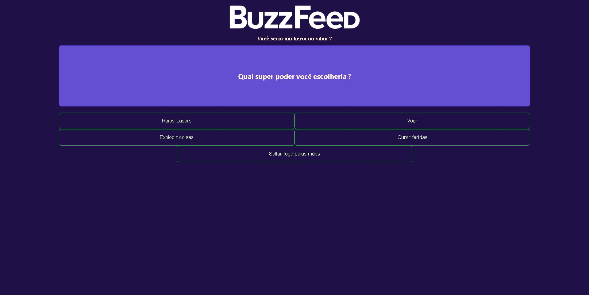
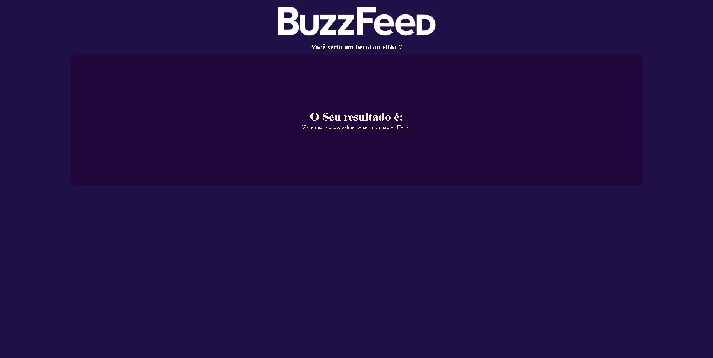

<h1 align="center"> Projeto Buzzfeed - Angular </h1>

Projeto desenvolvido no Bootcamp Cloud Fullstack, promovido pela DIO para ensino com foco em Angular.

<a href="#tecnologias">Tecnologias</a>&nbsp;&nbsp;&nbsp;|&nbsp;&nbsp;&nbsp;
<a href="#projeto">Projeto</a>&nbsp;&nbsp;&nbsp;|&nbsp;&nbsp;&nbsp;
<a href="#memo-licença">Licença</a>

 

Imagem da tela de uma pegunta do Projeto Buzzfeed (Imagem 1).

 
 

Imagem da tela de resultado do Projeto Buzzfeed (Imagem 2).

## Tecnologias

Esse projeto foi desenvolvido com as seguintes tecnologias:

- HTML e CSS
- JavaScript/TypeScript
- Angular
- Git e Github

## Projeto

O Projeto Buzzfeed é um projeto de um clone do site de mesmo nome, em que o usuário responde perguntas sobre um assunto, e em seguida, mostra o resultado, com base nas alterativas selecionadas.

## :memo: Licença

Esse projeto está sob licença MIT.

---

Projeto realizado pela DIO e feito por Victor Pimenta. [LinkedIn](https://www.linkedin.com/in/victor-cardoso-pimenta-0250371a0/)